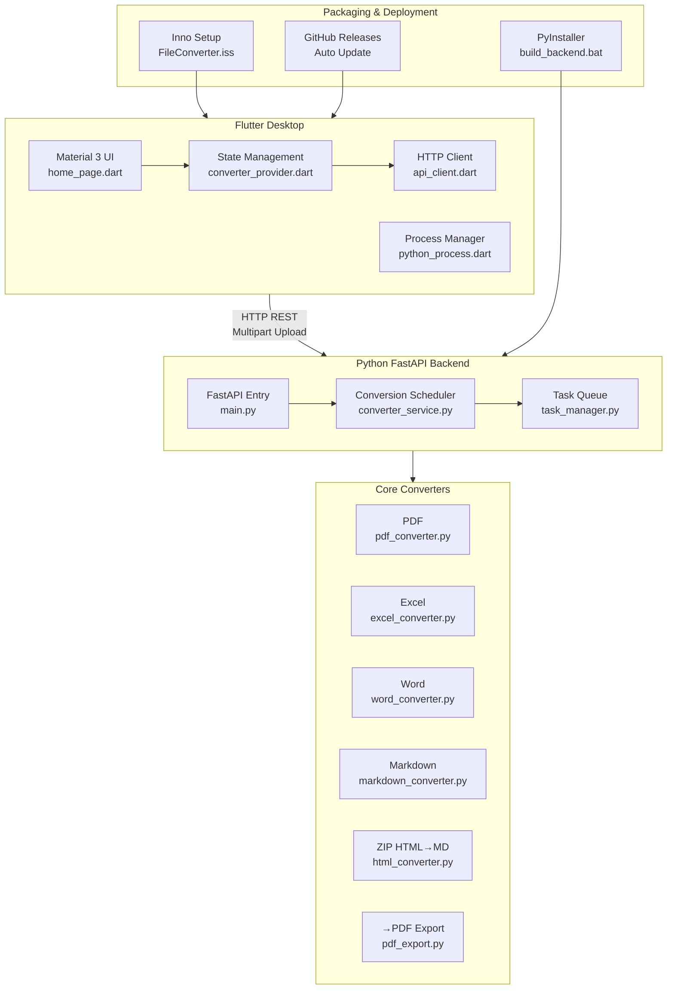

# FileConverter

A lightweight Windows desktop tool for converting between PDF, Excel, Word, and Markdown formats, plus **ZIP-packed HTML pages → Markdown** conversion.

Built with **Flutter frontend + Python FastAPI backend** architecture — Flutter handles UI, Python handles core conversion logic.

---

## Architecture



---

## Features

Supports 13 conversion combinations:

| Source \\ Target                | Excel | Word | Markdown |
| ------------------------ | ----- | ---- | -------- |
| **PDF**            | ✅    | ✅   | ✅       |
| **Excel**          | —    | ✅   | ✅       |
| **Word**           | ✅    | —   | ✅       |
| **Markdown**       | ✅    | ✅   | —       |
| **ZIP (HTML→MD)** | —    | —   | ✅       |

> **→PDF**  conversion（Excel→PDF、Word→PDF、Markdown→PDF）Requires **Microsoft Word** or **LibreOffice** to be installed.
>
> **ZIP→MD**  conversion works with browser **Ctrl+S** 'Web Page Complete' format (`.htm` + `_files/` resource directory), packed as ZIP.

---

## Usage

### Option 1: Development Mode

Run both frontend and backend.

**1. Start Python Backend**

```bash
pip install -r requirements.txt
cd python_backend
python main.py
```

**2. Start Flutter Frontend**

> Flutter automatically starts the Python backend process. To debug the backend separately, run `python python_backend/main.py` manually.

### Option 2: Build Distributable Installer

Use the one-click build script to package Python backend, build Flutter frontend, and generate Inno Setup installer.

```bash
./build_all.bat
```

Build artifacts:

- `flutter_app\build\windows\x64\runner\Release\FileConverter Setup.exe` — Installer
- `flutter_app\build\windows\x64\runner\Release\flutter_app.exe` — Flutter executable
- `flutter_app\build\windows\x64\runner\Release\backend\backend.exe` — Python backend executable

> The installer places files in `Program Files\FileConverter` and creates a Start Menu shortcut. The backend is packaged as a standalone exe — **no Python installation required**.

### Option 3: Step-by-Step Build

```bash
# 1. Package Python backend
./build_backend.bat

# 2. Build Flutter frontend
cd flutter_app
flutter build windows --release

# 3. Generate installer (requires Inno Setup)
iscc installer/FileConverter.iss
```

---

## Project Structure

```
FileConverter/
├── flutter_app/               # Flutter Frontend
│   └── lib/
│       ├── main.dart          # App entry
│       ├── pages/
│       │   └── home_page.dart # Main page
│       ├── widgets/
│       │   ├── file_picker_widget.dart      # File picker widget
│       │   ├── format_selector.dart         # Format selector widget
│       │   └── conversion_progress.dart     # Conversion progress widget
│       ├── providers/
│       │   └── converter_provider.dart      # State Management
│       ├── models/
│       │   ├── file_item.dart               # File model
│       │   └── task_progress.dart           # Task progress model
│       ├── services/
│       │   ├── api_client.dart              # HTTP Client
│       │   └── python_process.dart          # Python Process Manager
│       └── config/
│           └── api_config.dart              # API config
├── python_backend/             # Python FastAPI Backend
│   ├── main.py                 # FastAPI entry point
│   ├── services/
│   │   ├── converter_service.py # Conversion scheduler
│   │   └── task_manager.py     # Task Queue manager
│   └── temp/                   # Upload & temp output directory
├── converters/                 # Core Converters
│   ├── __init__.py             # Converter registry & dispatcher
│   ├── pdf_converter.py        # PDF input converter
│   ├── excel_converter.py      # Excel input converter
│   ├── word_converter.py       # Word input converter
│   ├── markdown_converter.py   # Markdown input converter
│   ├── html_converter.py       # ZIP (HTML) input converter
│   └── pdf_export.py           # Unified docx -> PDF export
├── requirements.txt            # Python dependencies
├── build_backend.bat           # PyInstaller backend packaging
├── build_all.bat               # One-click build script
├── installer/
│   └── FileConverter.iss       # Inno Setup installer script
└── README.md                   # Project documentation
```

---

## Tech Stack

| Layer    | Technology                                   |
| -------- | -------------------------------------------- |
| Frontend | **Flutter** 3.44+ / Dart 3.12+               |
| Backend  | **Python** 3.13+ / **FastAPI**               |
| Comm     | HTTP REST (Multipart upload)                 |
| PDF      | pdfplumber                                   |
| Excel    | openpyxl                                     |
| Word     | python-docx                                  |
| HTML     | beautifulsoup4                               |
| →PDF    | pywin32 / LibreOffice                        |
