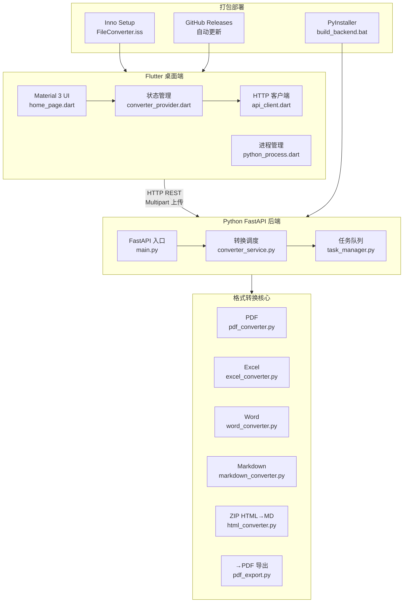

# 文件格式转换工具

一个轻量的 Windows 桌面工具，支持 PDF、Excel、Word、Markdown 四种格式之间的相互转换，以及 **ZIP 包中的 HTML 网页 → Markdown** 转换。

采用 **Flutter 前端 + Python FastAPI 后端** 架构，Flutter 负责 UI，Python 负责格式转换核心逻辑。

---

## 架构



---

## 功能

支持 13 种转换组合：

| 源\\ 目标                | Excel | Word | Markdown |
| ------------------------ | ----- | ---- | -------- |
| **PDF**            | ✅    | ✅   | ✅       |
| **Excel**          | —    | ✅   | ✅       |
| **Word**           | ✅    | —   | ✅       |
| **Markdown**       | ✅    | ✅   | —       |
| **ZIP (HTML→MD)** | —    | —   | ✅       |

> **→PDF** 的转换（Excel→PDF、Word→PDF、Markdown→PDF）需要系统已安装 **Microsoft Word** 或 **LibreOffice**。
>
> **ZIP→MD** 转换适用于浏览器 **Ctrl+S** 保存的「网页完整保存」格式（`.htm` + `_files/` 资源目录），打包为 ZIP 后拖入工具即可。

---

## 使用方式

### 方式一：开发运行

需要同时启动前端和后端。

**1. 启动 Python 后端**

```bash
pip install -r requirements.txt
cd python_backend
python main.py
```

**2. 启动 Flutter 前端**

> Flutter 会自动启动 Python 后端进程，无需手动启动。如需单独调试后端，可手动运行 `python python_backend/main.py`。

### 方式二：构建可分发安装包

使用一键构建脚本，依次打包 Python 后端、构建 Flutter 前端、生成 Inno Setup 安装包。

```bash
./build_all.bat
```

构建产物：

- `flutter_app\build\windows\x64\runner\Release\FileConverter Setup.exe` — 安装包
- `flutter_app\build\windows\x64\runner\Release\flutter_app.exe` — Flutter 可执行文件
- `flutter_app\build\windows\x64\runner\Release\backend\backend.exe` — Python 后端可执行文件

> 安装包会自动安装到 `Program Files\FileConverter`，并创建开始菜单快捷方式。后端已打包为独立 exe，**无需用户安装 Python 环境**。

### 方式三：分步构建

```bash
# 1. 打包 Python 后端
./build_backend.bat

# 2. 构建 Flutter 前端
cd flutter_app
flutter build windows --release

# 3. 生成安装包（需安装 Inno Setup）
iscc installer/FileConverter.iss
```

---

## 项目结构

```
FileConverter/
├── flutter_app/               # Flutter 前端
│   └── lib/
│       ├── main.dart          # 应用入口
│       ├── pages/
│       │   └── home_page.dart # 主页面
│       ├── widgets/
│       │   ├── file_picker_widget.dart      # 文件选择组件
│       │   ├── format_selector.dart         # 格式选择组件
│       │   └── conversion_progress.dart     # 转换进度组件
│       ├── providers/
│       │   └── converter_provider.dart      # 状态管理
│       ├── models/
│       │   ├── file_item.dart               # 文件模型
│       │   └── task_progress.dart           # 任务进度模型
│       ├── services/
│       │   ├── api_client.dart              # HTTP 客户端
│       │   └── python_process.dart          # Python 进程管理
│       └── config/
│           └── api_config.dart              # API 地址配置
├── python_backend/             # Python FastAPI 后端
│   ├── main.py                 # FastAPI 服务入口
│   ├── services/
│   │   ├── converter_service.py # 转换任务调度
│   │   └── task_manager.py     # 任务队列管理
│   └── temp/                   # 上传文件与转换输出临时目录
├── converters/                 # 格式转换核心逻辑
│   ├── __init__.py             # 转换注册表与调度入口
│   ├── pdf_converter.py        # PDF 输入转换
│   ├── excel_converter.py      # Excel 输入转换
│   ├── word_converter.py       # Word 输入转换
│   ├── markdown_converter.py   # Markdown 输入转换
│   ├── html_converter.py       # ZIP (HTML) 输入转换
│   └── pdf_export.py           # 统一 docx -> PDF 导出
├── requirements.txt            # Python 依赖
├── build_backend.bat           # PyInstaller 后端打包脚本
├── build_all.bat               # 一键构建脚本
├── installer/
│   └── FileConverter.iss       # Inno Setup 安装脚本
└── README.md                   # 项目说明文档
```

---

## 技术栈

| 层    | 技术                                       |
| ----- | ------------------------------------------ |
| 前端  | **Flutter** 3.44+ / Dart 3.12+       |
| 后端  | **Python** 3.13+ / **FastAPI** |
| 通信  | HTTP REST（Multipart 上传）                |
| PDF   | pdfplumber                                 |
| Excel | openpyxl                                   |
| Word  | python-docx                                |
| HTML  | beautifulsoup4                             |
| →PDF | pywin32 / LibreOffice                      |
