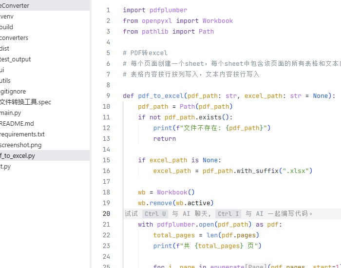

# 文件格式转换工具

一个轻量的 Windows 桌面工具，支持 PDF、Excel、Word、Markdown 四种格式之间的相互转换。

## 功能

支持 12 种转换组合：

| 源 \\ 目标 | Excel | Word | Markdown |
|-----------|-------|------|----------|
| **PDF**   | ✅    | ✅   | ✅       |
| **Excel** | —     | ✅   | ✅       |
| **Word**  | ✅    | —    | ✅       |
| **Markdown** | ✅ | ✅   | —        |

> **→PDF** 的转换（Excel→PDF、Word→PDF、Markdown→PDF）需要系统已安装 **Microsoft Word** 或 **LibreOffice**。

## 截图



## 使用方式

### 方式一：直接运行（需 Python 3.10+）

```bash
pip install -r requirements.txt
python main.py
```

### 方式二：打包 exe

```bash
pip install pyinstaller
pyinstaller --onefile --windowed --name "文件转换工具" --add-data "converters;converters" main.py
```

打包后在 `dist/文件转换工具.exe`，双击运行。

## 项目结构

```
FileConverter/
├── main.py              # 入口
├── converters/          # 转换核心
│   ├── pdf_converter.py
│   ├── excel_converter.py
│   ├── word_converter.py
│   └── markdown_converter.py
├── ui/
│   └── main_window.py   # 界面
└── requirements.txt
```

## 技术栈

- **Python** 3.13
- **tkinter** — 界面
- **pdfplumber** — PDF 解析
- **openpyxl** — Excel 读写
- **python-docx** — Word 读写